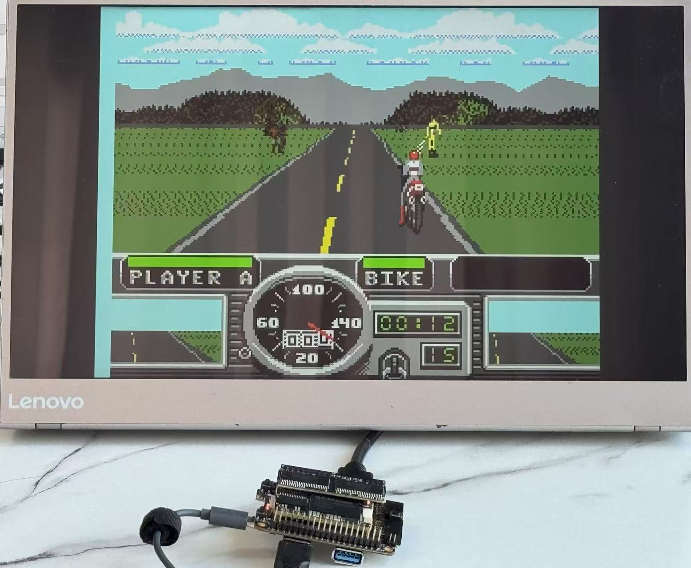

# SMSTang - Sega Master System for Sipeed Tang Console

This is a port of the [SMS-MiSTer](https://github.com/MiSTer-devel/SMS_MiSTer) core to Sipeed FPGA boards including Tang Console 60K and 138K.

SMSTang is part of [TangCore](https://github.com/nand2mario/tangcore), along with  [NESTang](https://github.com/nand2mario/nestang), [SNESTang](https://github.com/nand2mario/snestang), [GBATang](https://github.com/nand2mario/gbatang) and [MDTang](https://github.com/nand2mario/mdtang).

## Instructions

To install SMSTang, follow the [TangCore](https://github.com/nand2mario/tangcore) installation instructions**.

## Acknowledgements
* [SMS-MiSTer core](https://github.com/MiSTer-devel/SMS_MiSTer)
